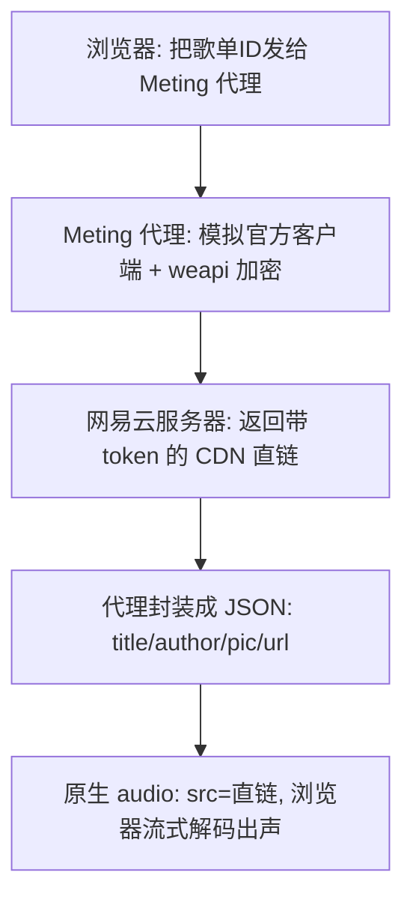

# 前台网易云音乐播放器 · 通用方案文档

> 适用场景：想在任何前端网页（博客、官网、作品集、SaaS 前台……）里嵌入一个**可用的网易云音乐播放器**。
> 核心思路一句话：**用服务端代理解开网易云加密的音频直链，前端只用原生 `<audio>` 播放，所有交互围绕这个 audio 元素手写。**
> 本文档与具体业务解耦，可直接照搬到新项目。

---

## 1. 这个方案解决什么问题

- 在网页前台放一个音乐播放器，**曲库来自网易云歌单**（不是让用户上传本地 mp3）。
- 提供完整播放体验：播放/暂停、上一首/下一首、随机、单曲循环、进度拖动、收藏、静音、歌单列表、锁屏控制。
- 零后端依赖（前端 + 一个公共/自建的 Meting 代理即可），可纯静态托管。

---

## 2. 原理：为什么必须走代理

网易云的歌**不能直接 `<audio src="...">` 播**，因为它有 3 道封锁：

| 封锁 | 说明 |
|------|------|
| 没有公开直链 | 歌单页面只返回曲目元数据，真实音频地址是服务器临时签发的，不在数据里 |
| 请求要加密（weapi） | 网易云前端 API 用 AES+RSA 混合加密（社区称 `weapi`/`linuxapi`），请求体必须加密才被服务器认 |
| CORS + Referer | 音频 CDN 校验 `Referer`，且接口不允许浏览器跨域调用 |

**Meting 代理（MetingJS / Meting API）** 就是破局点。它跑在服务器上，不受浏览器限制，复刻了网易云官方客户端的加密逻辑，用歌单 ID 向网易云换到"带 token、限时有效"的真实 CDN 直链，再包成一个简单 REST JSON 返回：

```
GET https://<你的Meting域名>/api?server=netease&type=playlist&id=歌单ID
→ [ { title, author, pic, url }, ... ]
```

浏览器只看到干净的 JSON，那个 `url` 就是能直接喂给 `<audio>` 的播放地址。

### 数据流



---

## 3. 快速落地（两种形态）

### 3.1 Astro 项目（已实现的版本，可直接参考）

- 组件：`src/components/MusicPlayer.astro`
- 挂载：在 `src/layouts/BaseLayout.astro` 里 `<MusicPlayer />`，全站每个页面都有
- 配置优先级（组件顶部）：后台「站点设置」`neteasePlaylistId` → 环境变量 `PUBLIC_NETEASE_PLAYLIST_ID` → 默认值
- 关键代码（取歌单 + 播）：

```js
const endpoint = new URL(apiBase, window.location.href);
endpoint.searchParams.set('server', 'netease');
endpoint.searchParams.set('type', 'playlist');
endpoint.searchParams.set('id', playlistId);
const res = await fetch(endpoint, { signal, mode: 'cors', credentials: 'omit' });
const data = await res.json();
const tracks = data
  .slice(0, 250)
  .map(item => ({ title: item.title, artist: item.author, cover: item.pic, url: item.url }))
  .filter(t => t.url);
// ...
audio.src = tracks[currentIndex].url;
audio.load();
audio.play();
```

- 不断歌技巧：组件加 `transition:persist="music-player"`，配合 Astro View Transitions，换页时 `<audio>` 节点保活。

### 3.2 任意前端（框架无关 · 原生 JS 版本）

下面这个自包含片段可丢进任何 HTML/React/Vue 页面，改两个常量即可用。

```html
<div id="player">
  <button id="toggle">播放/暂停</button>
  <input id="seek" type="range" min="0" max="1000" value="0" />
  <span id="now">未播放</span>
  <ul id="list"></ul>
</div>
<audio id="audio"></audio>

<script>
  const API = 'https://meting.mikus.ink/api';   // 换成你自建的 Meting 域名更稳
  const PLAYLIST_ID = '8792942606';             // 网易云歌单 ID
  const audio = document.getElementById('audio');
  const list = document.getElementById('list');
  const seek = document.getElementById('seek');
  const now = document.getElementById('now');
  let tracks = [];

  async function loadPlaylist() {
    const url = `${API}?server=netease&type=playlist&id=${PLAYLIST_ID}`;
    const ctrl = new AbortController();
    setTimeout(() => ctrl.abort(), 10000);
    const res = await fetch(url, { signal: ctrl.signal, mode: 'cors', credentials: 'omit' });
    const data = await res.json();
    tracks = data
      .map(t => ({ title: t.title, artist: t.author, cover: t.pic, url: t.url }))
      .filter(t => t.url);
    list.innerHTML = '';
    tracks.forEach((t, i) => {
      const li = document.createElement('li');
      li.textContent = `${t.title} - ${t.artist}`;
      li.style.cursor = 'pointer';
      li.onclick = () => play(i);
      list.appendChild(li);
    });
  }

  function play(i) {
    audio.src = tracks[i].url;
    audio.play();
    now.textContent = tracks[i].title;
  }

  document.getElementById('toggle').onclick = () =>
    audio.paused ? audio.play() : audio.pause();

  audio.ontimeupdate = () => {
    if (audio.duration) seek.value = String((audio.currentTime / audio.duration) * 1000);
  };
  seek.oninput = () => {
    if (audio.duration) audio.currentTime = (seek.value / 1000) * audio.duration;
  };
  audio.onended = () => play((tracks.findIndex(t => t.url === audio.src) + 1) % tracks.length);

  loadPlaylist();
</script>
```

---

## 4. 配置项清单

| 配置 | 含义 | 默认值 / 取值 |
|------|------|---------------|
| `neteasePlaylistId` / `PLAYLIST_ID` | 网易云歌单 ID | 在歌单 URL `playlist?id=xxxx` 里取 |
| `PUBLIC_MUSIC_API` / `API` | Meting 代理地址 | `https://meting.mikus.ink/api`（公共，不稳定） |
| 取歌数量上限 | 单次渲染曲目数 | 建议 ≤250 |

> 优先级约定（推荐）：后台设置 > 环境变量 > 代码默认值。这样换歌单不用改代码、不用重新构建。

---

## 5. 实现时别忘了的关键技术点

1. **请求加超时**：`fetch` 配 `AbortController`（10s），代理挂了不卡死页面。
2. **原生 `<audio>` 事件**（核心交互全靠它）：
   - `play` / `pause` → 切按钮图标与状态类
   - `timeupdate` → 读 `currentTime/duration` 更新进度
   - `loadedmetadata` → 拿总时长
   - `ended` → 自动播下一首
   - `error` → 跳过坏链（公共接口偶尔有死链）
3. **进度条用 `<input type=range>`**：拖动即 `audio.currentTime = ratio * duration`，不是自己画 canvas。
4. **状态持久化**：当前曲目 / 播放进度 / 音量 / 收藏 / 随机·循环偏好写入浏览器本地存储，key 带歌单 ID，刷新或换页后恢复。
5. **换页不断歌**：SPA 里让 player 组件不被卸载；Astro 用 `transition:persist`；传统多页用 `localStorage` 记录进度，回来续播。
6. **锁屏控制（加分项）**：用 `navigator.mediaSession` 写 `MediaMetadata`（封面/标题/歌手）并注册 `play/pause/next/prev` 回调，手机通知栏可遥控。
7. **降级提示**：代理不可用时显示"接口暂时不可用 + 重新加载按钮"，别白屏。

---

## 6. 生产环境注意事项

- **公共 Meting 接口（`meting.mikus.ink`）不稳定**：可能被限流、偶发挂、或被墙。**生产务必自建 Meting 实例**，把 `API` 指向自己的域名。
  - 自建方式任选：Vercel / 自有服务器 / Docker 部署 MetingJS；域名最好在国内可达。
- **直链时效性**：网易云返回的 CDN 直链带 token、限时有效。正常一首歌播放期间没问题；若做"预加载全部"要注意过期。
- **Referer 问题**：少数直链仍需 `Referer: music.163.com`，否则 403。公共/自建代理通常会返回已授权链接；若个别歌 403，可在代理侧加 header 转发或切换音质参数。
- **版权与合规**：网易云曲目受版权保护，此方案适合**个人/非商用**场景。商用或公开分发需取得授权，或改用下方"本地音频模式"。

---

## 7. 备选方案：本地音频模式（不依赖网易云）

如果曲库是你**自有版权**的音乐，更稳、更合规：

- 把 mp3 放到站点 `public/music/`
- 维护一份 `playlist.json`：`[{ title, artist, cover, url: "/music/xxx.mp3" }]`
- 前端 `fetch('/playlist.json')` 替代 Meting 接口，其余逻辑完全复用
- 优点：零第三方依赖、不怕墙、不怕限流、无版权风险

---

## 8. 新项目接入检查清单

- [ ] 确定曲库来源：网易云歌单（走 Meting）还是本地音频（走 playlist.json）
- [ ] 选定 Meting 代理地址（生产环境务必自建）
- [ ] 约定配置优先级：后台/环境变量/默认值
- [ ] 落地播放器组件（Astro 参考已有组件，其他框架用第 3.2 节原生版）
- [ ] 接好第 5 节的 7 个关键技术点
- [ ] 验证：播放、切歌、进度拖动、刷新续播、换页不断歌、手机锁屏控制
- [ ] 代理可用性兜底与"重新加载"按钮

---

*参考实现来源：本仓库 `apps/blog/src/components/MusicPlayer.astro`（Astro 版，含完整交互与持久化）。*
